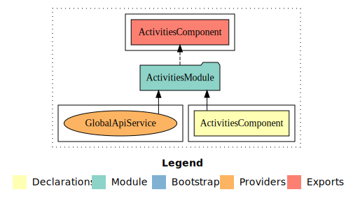

# 4V Gym

This is a web application for managing activities in a gym. It was created by Mikel Echeverria.

## Getting Started 🚀

These instructions will help you set up your development environment to run the project locally.

### Prerequisites 📋

What you need to install and how to install them.

* [Angular CLI](https://angular.io/guide/setup-local) - Install Angular CLI
* [NPM](https://www.npmjs.com/) - Package manager

### Installation 🔧

A series of example steps you can take to set up your development environment.

Clone the repository:

```shell
git clone https://github.com/MikelEcheverria/4VGym.git
```

Install dependencies:

```shell
npm install
```

## Project Generated with 🛠️

This project was generated with [Angular CLI](https://github.com/angular/angular-cli) version 17.0.10.

To install Angular CLI, run:

```shell
npm install -g @angular/cli
```

On Windows client computers, PowerShell script execution is disabled by default. To enable the execution of
PowerShell scripts, which is necessary for global npm binaries, set the following policy:

```shell
Set-ExecutionPolicy -Scope CurrentUser -ExecutionPolicy RemoteSigned
```

If you encounter an error with `npm install`, try using `npm install --legacy-peer-deps`.

## Running Tests ⚙️

Explain how to run automated tests for the system.

```shell
npm run test
```

## Deployment 📦

Add additional deployment notes here.

```shell
ng build --prod
```

To run the application locally, use the following command:

```shell
ng serve
```

## Diagram 📊



## Documentation 📖

The documentation of the project is in the [documentation](documentation) folder.
Or open documentation [here](https://byronndev.github.io/4V-GYM/documentation/)!.

## Built With 🛠️

* [Angular](https://angular.io/) - The web framework used
* [NPM](https://www.npmjs.com/) - Package manager

## Author ✒️

* **Mikel Echeverria** - *Initial work* - [MikelEcheverria](https://github.com/byronnDev)
